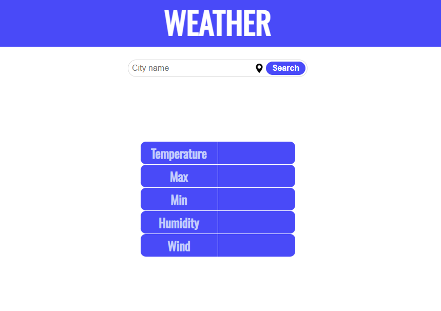

# 🌐 Gianluca Garzone - Web Developer Portfolio

Welcome to my personal portfolio!  

I'm a **junior front-end developer** based in Naples, Italy, currently improving my skills through self-learning and hands-on projects.

This website showcases my current skills, background, and a few sample projects—built with **HTML**, **CSS**, and **JavaScript**.

---

## 🚀 Live Preview

🔗 [Visit the live site](https://gianni16.github.io/start2impact-webpage-2.0/)  

---

## 🛠️ Tech Stack

- HTML5  
- CSS3 (custom styles + Animate.css)  
- JavaScript (DOM manipulation)  
- Google Fonts  
- OpenWeatherMap API (for weather project)

---

## 📂 Pages

- `/index.html` → About me  
- `/index-portfolio.html` → Portfolio with project previews  
- *(Blog section in progress)*

---

## 🧪 Projects

### ☀️ Weather App
A simple weather application built using the [OpenWeatherMap API](https://openweathermap.org/api).  
Displays current weather conditions based on user input.

---

## 📫 Contact

Feel free to reach out or connect:

- 📧 Email: [gi.garzone@gmail.com](mailto:gi.garzone@gmail.com)  
- 💼 LinkedIn: [linkedin.com/in/gianluca-garzone](https://www.linkedin.com/in/gianluca-garzone/)  
- 🐱 GitHub: [github.com/Gianni16](https://github.com/Gianni16)

---

## 📌 Notes

- This is a personal project, continuously evolving.  
- Icons and images are stored locally under `/f
